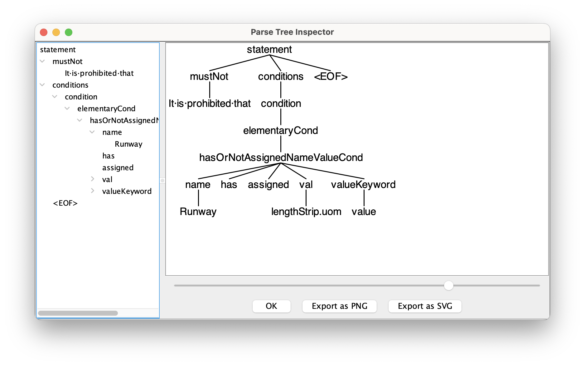

# AIXM SBVR Parser and Validator

## SBVR
Current SVBR:
https://ext.eurocontrol.int/aixm_confluence/display/AIXMBR/Rules+definition+using+SBVR

The SBVR grammar taken here is the under-work 2.0.

## ANTLR4

ANTLR4 getting started https://github.com/antlr/antlr4/blob/master/doc/getting-started.md

The book is highly recommended: https://pragprog.com/titles/tpantlr2/the-definitive-antlr-4-reference/

To avoid problem where only a part is processed and a later invalid part is just skipped:
https://stackoverflow.com/questions/2579118/why-does-antlr-not-parse-the-entire-input

## Grammar

See [src/main/antlr4/eu/eurocontrol/sbvr/AixmSbvrEbnf.ebnf](src/main/antlr4/eu/eurocontrol/sbvr/AixmSbvrEbnf.ebnf) for the original EBNF, and its translation in ANTLR4 [src/main/antlr4/eu/eurocontrol/sbvr/AixmSbvr.g4](src/main/antlr4/eu/eurocontrol/sbvr/AixmSbvr.g4).

## Build, test, run

```bash
# To build & test:
mvn clean package     # includes mvn antlr4:antlr4

# To run:
java -jar target/sbvr-parser-1.0-SNAPSHOT-jar-with-dependencies.jar App
```

Antlr4 maven plugin will generate sources [here](target/generated-sources/antlr4/eu/eurocontrol/sbvr/), which are extended or used in the rest of the code. So after a `mvn clean` you'll see errors - that is normal.

## Using grun to show parse trees, and other tools
Visual Code has good tooling: https://github.com/mike-lischke/vscode-antlr4

For `grun` follow the instructions in the ANTLR4 Getting Started.

```bash
mvn package
cd target/classes
grun eu.eurocontrol.sbvr.AixmSbvr statement -gui
# Program is waiting for stdin input, so type:
It is prohibited that Runway has assigned lengthStrip.uom value
Ctrl-D
```
A window pops up: .

